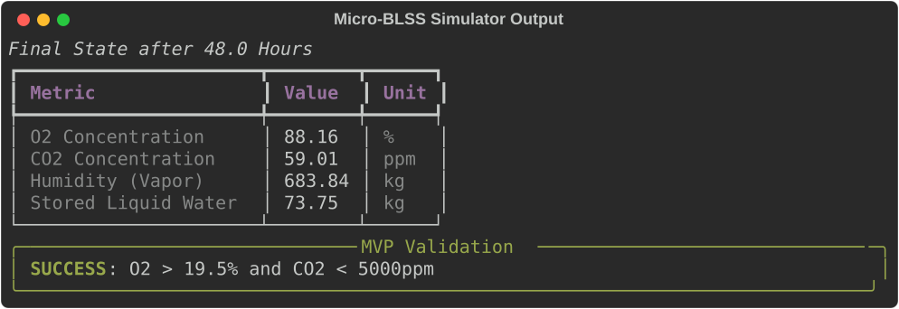
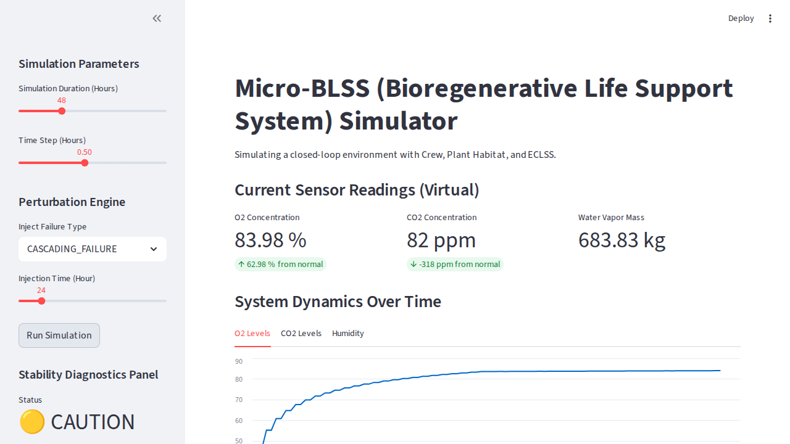

# Micro-BLSS Simulator

## 1. Project Vision & Goals
**Micro-BLSS** (Micro Bioregenerative Life Support System) is a Python-based Digital Twin of a closed ecological system. It aims to simulate mass balance, plant growth, and metabolic exchange to support human life in high-frequency cycling environments (small habitats) based on MELiSSA (Micro-Ecological Life Support System Alternative). The goal is to transition from simulation to a physical "Home-based Sealed Plant Habitat."

This Digital Twin integrates logic translated directly from the [V-HAB project](https://github.com/V-HAB/V-HAB), specifically mimicking:
1. **Crew Metabolism:** Human $O_2$ consumption and $CO_2$/water vapor production.
2. **Plant Habitat:** Crop photosynthesis and evapotranspiration.
3. **Physio-Chemical ECLSS:** $CO_2$ filtering (CDRA) and active dehumidification.
4. **Buffer Reservoir:** The atmospheric and liquid storage balancing the whole system.

The code is strictly modular and Object-Oriented, fully typed, and employs virtual sensor abstraction (`get_sensor_reading`) designed to be a drop-in replacement for Hardware-In-The-Loop testing in the future (e.g., using real DHT22 and MH-Z19B sensors via MQTT).

---

## 2. System Architecture
The simulator is divided into self-contained Python modules representing distinct life-support compartments.

* `src/modules/crew.py` (`CrewCompartment`): Tracks human metabolic cycles.
* `src/modules/plant.py` (`PlantHabitat`): Uses the Modified Energy Cascade (MEC) logic for Carbon Gain, Canopy Quantum Yield, and Penman-Monteith transpiration modeling via `scipy.integrate.solve_ivp`.
* `src/modules/physio_chemical.py` (`PhysioChemicalModule`): Contains a custom PID controller for humidity management and threshold-based $CO_2$ scrubbing.
* `src/modules/buffer.py` (`BufferReservoir`): Handles mass conversion to environmental concentrations (ppm, %) via the Ideal Gas Law.
* `src/core/sensors.py`: Abstract sensor registry with Gaussian noise mocking.
* `src/core/stability.py` (`StabilityMonitor`): Provides an early warning module calculating Closure Index ($C_i$), concentration derivatives, and Time-to-Failure (TTF) predicting system oscillation or critical transition.
* `src/core/simulation.py` (`Simulation`): Orchestrates the update ticks (`dt_hours`), mass transfers, tracks stability, and includes a Perturbation Engine for testing cascading failures and rapid cycle oscillations.
* `src/utils/validation.py` (`PhysicalValidator`): Dedicated Verification & Validation (V&V) layer that performs real-time stoichiometric mass conservation checks and Respiratory Quotient (RQ) monitoring to prevent numerical instability or unit errors.

---

## 3. Installation

Requires **Python 3.11+**.

This project uses [`uv`](https://github.com/astral-sh/uv) for fast and reproducible dependency management.

```bash
# Clone the repository
git clone <repository-url>
cd micro-blss

# Install dependencies and create a virtual environment (.venv)
uv sync

# If you need to develop or run tests, install dev dependencies
uv sync --dev
```

---

## 4. Usage

### CLI Simulation execution
Run the core 48-hour simulation from the command line. It uses the `rich` library to beautifully display the process and validate the safety thresholds (e.g., $O_2 > 19.5\%$ and $CO_2 < 5000$ ppm).

```bash
# Execute the simulation module
uv run python -m src.core.simulation
```



### Streamlit Interactive Dashboard
Launch the visual web dashboard to run simulations with dynamic sliders for simulation time and tick rate, and to view interactive line charts of gas concentrations and water vapor mass over time.

```bash
# Start the Streamlit application
uv run streamlit run app.py
```



---

## 5. Verification & Validation (V&V)

The project includes a robust test suite focusing on mathematical parity with the original MATLAB V-HAB model, catching any regressions during modifications. The `pytest` framework is utilized.

```bash
# Run the complete test suite
uv run pytest tests/ -v

# Run with coverage report
uv run pytest tests/ --cov=src
```
